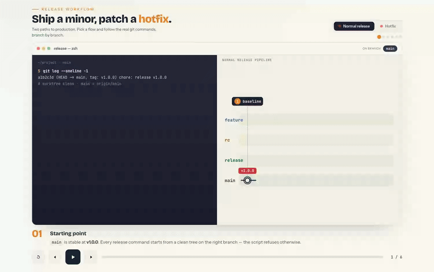

# Release Workflow Template

Copyable release automation for npm projects. `template/` is the only canonical payload.

## Workflow Walkthrough

An animated, interactive explainer lives in [`release-workflow.html`](release-workflow.html) — a
single self-contained page (no build, no dependencies) that plays through both flows step by step:
the git commands (terminal), the branch/merge diagram, and a traveling callout that narrates each
step.



> A README can't run the page's JavaScript (GitHub strips `<script>`), so the GIF above is just a
> preview. To **play the interactive version**:
>
> - **Locally** — open the file in any browser:
>   ```bash
>   open release-workflow.html            # macOS
>   # xdg-open release-workflow.html      # Linux
>   # start release-workflow.html         # Windows
>   ```
> - **Hosted, zero setup** — once this repo is on GitHub, the live page is available through githack:
>   `https://raw.githack.com/<OWNER>/<REPO>/main/release-workflow.html`
> - **GitHub Pages** — Settings → Pages → deploy from `main` (root); it is then served at
>   `https://<OWNER>.github.io/<REPO>/release-workflow.html`
>
> Controls: `space` = play/pause · `←` / `→` = step · tabs switch **Normal release / Hotfix**.
> `release-workflow.mp4` is also included for pasting into issues, PRs, or Slack.

## Install Into A New Project

From the target project root, with this template repository available at `<template-repo>`:

```bash
cp -R <template-repo>/template/. .
chmod +x scripts/release.sh
```

Add package scripts:

```json
{
  "scripts": {
    "release:init": "bash scripts/release.sh init",
    "release:patch": "bash scripts/release.sh patch",
    "release:rc": "bash scripts/release.sh rc",
    "release:rc:minor": "bash scripts/release.sh rc:minor",
    "release:rc:major": "bash scripts/release.sh rc:major",
    "release:rc:promote": "bash scripts/release.sh rc:promote"
  }
}
```

## Verify Template

```bash
bash scripts/verify-template.sh
```

## Contract

- Stable line: `main`.
- Frozen train branch: `rc/vX.Y.Z-rc.1`.
- Advancing RC package versions/tags: `X.Y.Z-rc.N` / `vX.Y.Z-rc.N`.
- Promotion branch: `release/vX.Y.Z`.
- Stable tag: `vX.Y.Z`, after promotion PR merge.

Promotion always starts from the tested frozen RC branch. The RC branch itself is not merged first.

`main` is part of this template's contract, not a runtime option. Projects using another stable branch must edit:

- `STABLE_BRANCH` and `origin/main` validation in `scripts/release.sh`.
- Main branch guard in `.github/workflows/release-dispatch.yml`.
- Pull-request target in `.github/workflows/release-tag-after-merge.yml`.
- Stable-branch wording in `README.release.md`.
